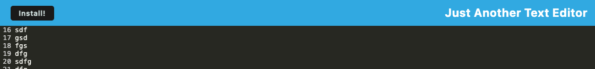

# Progressive Web Application

## Description

Progressive Web Application is a text editing application that will continue to run with a poor internet connection or even offline completely. As with all PWAs, this application will cache important information which allows the app to load and function without constant internet.

## Installation

To install this application, open the Terminal for the main directory of the application. Then to load all the necessary node packages enter npm i in the command line.

To initialize and launch the application enter npm run start into the command line.

## Usage

Once the application has been launched, navigate to http://localhost:3000 in your favorite web browser to start using this application. 

This application is a simple text editor. Simply add text. To fully utilize this application and have persistence regardless of internet connections status click the install button at the top of the webpage.

## Credits

Thanks goes to the University of Minnesota and Edx Bootcamp for providing the assistance needed to complete this project. Special thanks goes to the instructor G Almes for providing additional starter code for this project.

## License

MIT License

Copyright (c) 2024 helm0127

Permission is hereby granted, free of charge, to any person obtaining a copy
of this software and associated documentation files (the "Software"), to deal
in the Software without restriction, including without limitation the rights
to use, copy, modify, merge, publish, distribute, sublicense, and/or sell
copies of the Software, and to permit persons to whom the Software is
furnished to do so, subject to the following conditions:

The above copyright notice and this permission notice shall be included in all
copies or substantial portions of the Software.

THE SOFTWARE IS PROVIDED "AS IS", WITHOUT WARRANTY OF ANY KIND, EXPRESS OR
IMPLIED, INCLUDING BUT NOT LIMITED TO THE WARRANTIES OF MERCHANTABILITY,
FITNESS FOR A PARTICULAR PURPOSE AND NONINFRINGEMENT. IN NO EVENT SHALL THE
AUTHORS OR COPYRIGHT HOLDERS BE LIABLE FOR ANY CLAIM, DAMAGES OR OTHER
LIABILITY, WHETHER IN AN ACTION OF CONTRACT, TORT OR OTHERWISE, ARISING FROM,
OUT OF OR IN CONNECTION WITH THE SOFTWARE OR THE USE OR OTHER DEALINGS IN THE
SOFTWARE.

